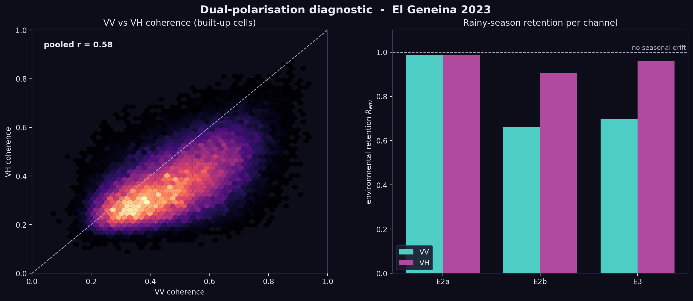
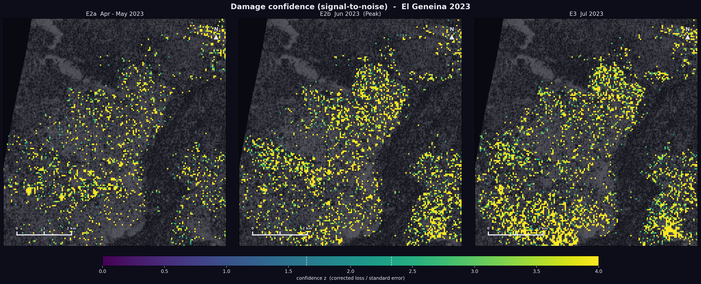
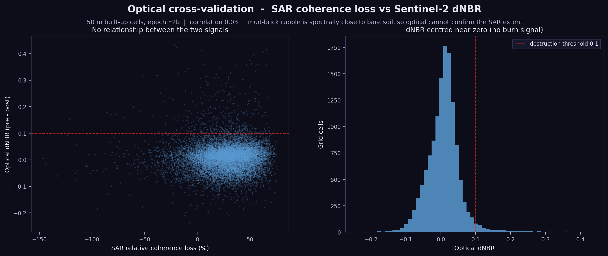

# El Geneina InSAR Coherence Change Detection

Building-level damage mapping for El Geneina (al-Junaynah), West Darfur, during
the 2023 conflict, derived from Sentinel-1 InSAR coherence loss.

Between April and July 2023, El Geneina was the site of large-scale violence and
destruction during the Rapid Support Forces (RSF) offensive in West Darfur.
Persistent cloud cover and the absence of ground access make optical assessment
unreliable. Synthetic Aperture Radar (SAR) works regardless of cloud cover or
daylight, and interferometric **coherence** is highly sensitive to physical change on the
ground: when a building is destroyed, the radar surface decorrelates and
coherence drops. This project turns that signal into a damage map of the city.

The statistical unit is a **resolution-matched grid** rather than the individual
building. HOT OSM footprints in El Geneina have a median area near 15 m2, well
below a single 10 m Sentinel-1 pixel (100 m2), so a per-building coherence value
is a sub-pixel sample shared with its neighbours. Aggregating onto a 50 m grid
restores several independent coherence estimates per cell, which is the
defensible unit for reporting. Each building then inherits the class of the cell
it falls in, so the map keeps the familiar footprint view while the numbers rest
on the grid. This mirrors the damage-density approach used in UNOSAT Sentinel-1
coherence products.

> Background and discussion: [LinkedIn post](https://www.linkedin.com/posts/sebastian-macherey-1b140b316_remotesensing-insar-sar-ugcPost-7451764362064809984-_lhB/)


---

## Background

Since April 2023 a power struggle between the Sudanese Armed Forces (SAF) and the
paramilitary Rapid Support Forces (RSF) has driven one of the world's most severe
humanitarian crises. In West Darfur the violence took on a targeted ethnic
dimension. The RSF, which evolved from the Janjaweed militias, used tactics seen
in the genocide twenty years earlier: deliberate arson, snipers targeting
civilians at water sources, and total sieges. Human Rights Watch has documented a
systematic campaign of ethnic cleansing against the Masalit, Fur and Zaghawa
communities.

The destruction in El Geneina followed a calculated strategy of displacement. As
this analysis shows, the western districts, predominantly inhabited by the
Masalit, were systematically burned and the ruins leveled to erase their physical
footprint and prevent return. In June 2023 the RSF seized full control of the
city. Up to 15,000 people were killed in El Geneina alone, most of them targeted
because of their Masalit identity, and hundreds of thousands fled toward Chad,
South Sudan and Egypt.

Remote sensing cannot stop atrocities, but public satellite data provides an
objective, independent record of destruction when ground access is barred.

Conflict chronology, measured as the share of built-up grid cells per epoch
(50 m grid). The coherence is estimated on both polarisations and fused (mean of
the per-channel relative loss, see Dual-polarisation analysis). All classes are
drift-corrected for rainy-season decorrelation, a single consistent scale; the
higher raw values are reported as an upper bound under Baseline robustness:

| Epoch | Period | Affected built-up area | Severe |
| :--- | :--- | ---: | ---: |
| E1 | Mar-Apr 2023 | pre-conflict baseline | - |
| E2a | Apr-May 2023 | 12 % (initial offensive and arson) | 0.1 % |
| E2b | Jun 2023 | 21 % (peak destruction phase) | 0.0 % |
| E3 | Jul 2023 | 24 % (continued change, RSF control) | 0.0 % |

Each epoch measures active surface change within its own window against the
pre-conflict reference, not a cumulative total, so E3 reflects continued July
change (ongoing activity plus residual rain) rather than June damage carried
forward.

Across the 137,545 quality-controlled HOT OSM building footprints
([cleaning report](docs/CLEANING_REPORT.md)), the corrected affected signal runs
from 12 % during the dry-season first offensive (E2a) to about 21 to 24 % for the
June and July epochs. The dry-season E2a figure is the single most robust value
because the seasonal correction barely moves it. The corrected severe class is
small once the seasonal signal is removed: destruction past 60 % excess coherence
loss is rare and spatially clustered rather than pervasive. The raw uncorrected
extent runs to about two thirds, but that is dominated by rainy-season
decorrelation rather than destruction, and high-resolution optical imagery shows
nothing near that extent (see Optical cross-validation).

**Interpretation.** InSAR is weather-independent but needs careful reading.
Environmental factors such as sand drift or heavy rain can cause decorrelation
and false positives. SAR gives a forensic overview but cannot separate arson from
shelling, so cross-validation with high-resolution optical imagery remains
essential for final attribution.

---

## Method

**Coherence Change Detection (CCD).** Interferometric coherence is computed for
12-day Sentinel-1A pairs grouped into four epochs. Each epoch is compared
against the pre-conflict reference (E1). A grid cell whose coherence collapses
relative to E1 is flagged as damaged, binned into four classes by the relative
coherence loss.

| Epoch | Period | Role |
| :--- | :--- | :--- |
| **E1** | Mar-Apr 2023 | Pre-conflict reference (city intact) |
| **E2a** | Apr-May 2023 | First strike (after conflict onset 15 Apr) |
| **E2b** | Jun 2023 | Peak destruction (around the 14-22 Jun massacre) |
| **E3** | Jul 2023 | Post-conflict (city under RSF control) |

**Damage classes** (relative coherence loss vs. E1):

| Class | Loss | Meaning |
| :--- | :--- | :--- |
| 0 | < 20 % | No damage |
| 1 | >= 20 % | Light |
| 2 | >= 40 % | Moderate |
| 3 | >= 60 % | Severe |

**Footprint quality control.** The HOT OSM download is screened once before any
coherence is sampled (`clean_buildings.py`). The screening repairs or drops
invalid and empty geometries, removes exact duplicates, micro polygons below
1 m2, line-like slivers, sites tagged as still under construction, and footprints
outside the study area. The filters are deliberately conservative, so the damage
percentages stay unbiased: only 15 of 137,560 footprints are removed (99.99 %
retained). Every removed feature is counted by category in the
[cleaning report](docs/CLEANING_REPORT.md).

**Resolution-matched grid.** The [HOT OSM](https://www.hotosm.org/) footprints
in El Geneina have a median area near 15 m2, far below a 10 m Sentinel-1 pixel
(100 m2). Only about 190 of the 137,545 buildings cover four or more pixels, so
true per-building zonal statistics are not supported by the data, and adjacent
buildings share pixels. Coherence is therefore aggregated onto a grid aligned to
the reference raster, computed over built-up cells only (cells containing at
least one footprint) with area-weighted zonal statistics (`exactextract`). Each
building inherits the class of its cell for the map.

**Cell size: 50 m, chosen by sensitivity analysis.** The classification was run
at 30 m, 50 m and 100 m. The affected extent is stable across scales, but the
severe class is scale-dependent: at 100 m, total destruction is smaller than one
cell and gets averaged out, while at 30 m a single decorrelated pixel can flip a
cell. A 50 m cell holds 25 pixels, which keeps a stable mean and still resolves
the severity gradient.

| Epoch | 30 m | 50 m | 100 m |
| :--- | ---: | ---: | ---: |
| E2a | 18.1 / 0.1 | 13.6 / 0.1 | 5.7 / 0.1 |
| E2b | 59.4 / 2.0 | 61.4 / 0.5 | 66.8 / 0.0 |
| E3 | 62.2 / 0.5 | 64.9 / 0.1 | 69.1 / 0.0 |

*Affected % / severe % of built-up cells per epoch (raw VV+VH fused loss, before
drift correction). Built-up cells: 30,005 (30 m), 13,152 (50 m), 3,925 (100 m).*

Cells outside the area of valid coherence are excluded rather than bridged.

---

## Pipeline

```
Sentinel-1 SLC (.SAFE.zip)
        |
        v
  preprocess.py        TOPSAR-Split (IW1, VV+VH) + Apply-Orbit-File  ->  BEAM-DIMAP
        |
        v
  run_insar.py         Back-Geocoding -> Interferogram + Coherence ->
                       TOPSAR-Deburst -> Goldstein filter -> Subset (AOI) ->
                       Terrain-Correction  ->  coherence GeoTIFF per pair
                       and polarisation (VV + VH)
        |
        v
  check_quality.py     validate projection, bands and valid-pixel counts
        |
        v
  clean_buildings.py   quality-control the HOT OSM footprints (validity,
                       duplicates, micro slivers, tags, AOI) -> removal report
        |
        v
  classify_damage.py   shared coherence sampling + relative loss vs. E1 +
                       damage-class logic (imported by classify_grid)
        |
        v
  classify_grid.py     aggregate coherence onto the 50 m grid, classify cells,
                       run the cell-size sensitivity table, attribute the cell
                       class back to each building  ->  GeoPackage
        |
        v
  check_baseline.py            E1 reference stability + false-positive floor
  correct_baseline_drift.py    rainy-season correction from unbuilt reference
                               (per-polarisation R_env, VV and VH fused)
  compare_polarisations.py     VV/VH correlation + per-channel rain robustness
  uncertainty.py               per-cell damage confidence (signal-to-noise z)
  validate_optical.py          Sentinel-2 dNBR cross-check (validation ceiling)
        |
        v
  viz_*.py             figures (damage overview, pre-conflict reference)
```

The InSAR stages (`preprocess.py`, `run_insar.py`) drive [ESA SNAP](https://step.esa.int/)
through its Python bridge (`esa_snappy`). The analysis and visualization stages
use the standard geospatial Python stack.

---

## Results


*Pre-conflict reference (E1): InSAR coherence per building before the conflict.*

---

## Dual-polarisation analysis

The scenes are acquired in VV and VH, and the coherence is estimated on both
channels. VV is the co-pol channel; VH is the cross-pol channel, dominated by
volume scattering and therefore lower in absolute coherence. Two properties make
the second channel worth processing (`compare_polarisations.py`):

- **VH adds independent information.** Across built-up cells the VV and VH
  coherence correlate only moderately (r roughly 0.4 to 0.6), so averaging the
  two is genuine noise reduction rather than repeating one signal.
- **VH is more robust to the rainy season.** The cross-pol channel decorrelates
  far less than VV under the Sahel rains (see the per-polarisation R_env under
  Baseline robustness), so it carries damage signal where VV is swamped by
  seasonal noise.

Because VH coherence sits systematically below VV, the channels are not averaged
directly. Each is normalised against its own pre-conflict E1 baseline into a
relative loss, and the two relative losses are then averaged (mean fusion). This
runs through both the raw classification and the drift correction, so every
reported figure is the fused VV+VH result.



---

## Baseline robustness

Two checks separate genuine conflict damage from baseline and seasonal noise.

**Pre-conflict reference (E1) stability** (`check_baseline.py`). The damage signal
is the coherence drop relative to E1, so the reference itself has to be stable.
E1 spans two consecutive pre-conflict 12-day pairs; comparing them shows the
apparent loss of the intact city with no conflict at all. The two pairs
correlate at 0.76 with a 10.7 % median relative difference. The false-positive
floor that follows is informative:

| Threshold | Intact city flagged |
| :--- | ---: |
| >= 20 % loss (light) | 9.2 % of cells |
| >= 40 % loss (moderate) | 0.9 % of cells |
| >= 60 % loss (severe) | 0.0 % of cells |

The severe class is essentially free of baseline noise. The light class carries a
real floor near 9 %, so a single light cell means less than a clustered severe
one.

**Rainy-season drift correction** (`correct_baseline_drift.py`). The Sahel rains
begin in June and lower coherence over bare ground regardless of the conflict.
The seasonal retention R_env is estimated from stable unbuilt reference cells,
separately per polarisation, and this is where the cross-pol channel earns its
place: VH decorrelates far less than VV in the rain.

| Epoch | R_env VV | R_env VH |
| :--- | ---: | ---: |
| E2a (May) | 0.99 (1 % loss) | 0.99 (1 % loss) |
| E2b (Jun) | 0.66 (34 % loss) | 0.91 (9 % loss) |
| E3 (Jul) | 0.70 (30 % loss) | 0.96 (4 % loss) |

About a third of the June and July VV coherence drop is seasonal rather than
damage, but the VH channel barely moves. Correcting each channel against its own
retention and fusing the result removes the season while keeping the rain-robust
VH signal:

| Epoch | Raw affected | Drift-corrected |
| :--- | ---: | ---: |
| E2a | 13.6 % | 12.2 % |
| E2b | 61.4 % | 20.6 % |
| E3 | 64.9 % | 24.3 % |

Bare soil decorrelates more readily than the hard targets of a built environment,
so R_env is a strong, conservative estimate of the seasonal effect. Read the raw
figures as an upper bound and the corrected figures as a lower bound: the true
damage extent lies between them. Once the season is removed, the corrected
affected extent runs from 12 % in the dry-season offensive (E2a) to about 21 to
24 % for the June and July epochs.

---

## Damage confidence

The classification uses fixed relative-loss thresholds. To show how trustworthy
each call is, every built-up cell also carries a signal-to-noise z-score
(`uncertainty.py`): the drift-corrected coherence drop divided by its standard
error, estimated from the within-cell spatial spread of coherence. A high z means
the drop is large relative to the local variability.



Two things follow. First, the fixed thresholds are not arbitrary: the cells the
20 % rule marks as affected are essentially all statistically confident
(z >= 1.6 for 100 %, z >= 2.3 for 97 to 99 %), while non-affected cells sit at
z near 0. The threshold extent and the significant extent coincide. Second, there
is a confidence gradient within the affected area (median z about 4.3, rising past
15 in the core), so the map distinguishes a high-confidence damage core from
marginal edges. Pixels in a cell are spatially correlated, so z reads as a
relative confidence rather than a strict p-value; the dominant uncertainties
remain the seasonal bracket above and the baseline floor.

---

## Optical cross-validation

An independent check tests whether optical imagery confirms the SAR extent
(`validate_optical.py`). The reference is the change in the Normalised Burn Ratio
(dNBR) between two cloud-free, phenology-matched dry-season Sentinel-2 scenes a
year apart (Dec 2022 vs Nov 2023), streamed from the Earth Search STAC and
averaged onto the same 50 m grid.

The optical map does not reproduce the SAR damage pattern: the correlation
between coherence loss and dNBR is 0.03, and only about 3 % of built-up cells
cross the dNBR threshold, within the noise of the index.



This is a property of the fabric, not a refutation of the SAR. El Geneina is
built from mud brick, so a destroyed building collapses into rubble that is
spectrally almost identical to the surrounding bare soil; at 10 to 20 m
resolution, optical change detection has too little contrast to see it. SAR
coherence responds to the geometric disturbance regardless of spectral
signature, which is why it carries the signal where optical does not. The check
rules out the raw two-thirds figure as literal building destruction, consistent
with the corrected lower bound, but it cannot positively confirm that bound: a
definitive optical validation would need sub-metre imagery (UNOSAT or Maxar
damage points), not Sentinel-2. Confidence therefore rests on the internal
checks above. Full numbers: [docs/OPTICAL_VALIDATION.md](docs/OPTICAL_VALIDATION.md).

---

## Caveats

- **Coherence loss is a proxy.** It records physical surface change, not its
  cause. Conflict damage, construction, flooding and vegetation change all
  decorrelate the signal, so attribution to shelling or arson needs
  high-resolution optical cross-validation. A Sentinel-2 dNBR check could not
  confirm the extent (see Optical cross-validation): mud-brick rubble is
  spectrally close to bare soil, so this needs sub-metre imagery.
- **Rainy-season decorrelation.** The Sahel rains begin in June, which lowers
  coherence over bare and vegetated ground independently of the conflict. This
  inflates the E2b and E3 affected figures, so those epochs read as an upper
  bound. The drift correction above brackets the effect with a lower bound from
  stable unbuilt reference areas.
- **12-day revisit.** Sub-epoch timing of individual events cannot be resolved.
- **Sub-pixel footprints.** The grid is the honest reporting unit, but the
  underlying resolution still cannot characterise an isolated 15 m2 structure on
  its own.

**Future work.** Beyond the dual-pol fusion, drift correction and confidence
layer already in place, the natural extensions are a SAR amplitude (intensity
log-ratio) channel to complement coherence, an ascending-orbit track to reduce
layover ambiguity, and a deep-learning segmentation step (for example a U-Net on
Sentinel-1) to suppress environmental false positives. The deep-learning
direction is planned as a separate project rather than part of this pipeline.

---

## Repository layout

```
config.py               Single source of truth: paths, AOI, epochs, pairs, parameters, styling
snap.py                 ESA SNAP / esa_snappy bridge wrapper

preprocess.py           Stage 1: TOPSAR-Split + Apply-Orbit-File (+ subswath/burst helpers)
run_insar.py            Stage 2: coherence GeoTIFF per pair and polarisation (VV+VH)
check_quality.py        GeoTIFF quality check
clean_buildings.py      Stage 0: HOT OSM footprint quality control + removal report
classify_damage.py      Stage 3: shared coherence-sampling + damage-class logic (VV+VH fusion)
classify_grid.py        Stage 3b: 50 m grid classification + sensitivity table
check_baseline.py       Stage 3c: E1 reference stability + false-positive floor
correct_baseline_drift.py  Stage 3c: rainy-season drift correction (per-pol R_env, VV+VH fused)
compare_polarisations.py   Stage 3e: VV/VH correlation + per-channel rain robustness
uncertainty.py          Stage 3f: per-cell damage confidence map (signal-to-noise z)
validate_optical.py     Stage 3d: Sentinel-2 dNBR cross-validation (streamed COGs)

viz_common.py           Shared loading/clipping helpers for figures
viz_damage_overview.py  Three-panel damage overview
viz_supplementary.py    Pre-conflict reference figure

data/aoi/               Area-of-interest definition (GeoJSON, version-controlled)
docs/DATA.md            How to obtain the Sentinel-1 scenes and building footprints
assets/                 Rendered showcase figures
tests/                  Pytest smoke tests (config, scene catalog, damage logic)
.github/workflows/      Continuous integration (runs the tests on every push)
```

The large raw and intermediate data (Sentinel-1 scenes, processing
intermediates, building footprints) is **not** version-controlled. It is
reproducible from public sources, documented in [docs/DATA.md](docs/DATA.md).

---

## Setup & workflow

The analysis/visualization stages and the SNAP-based InSAR stages have different
requirements. A conda environment is recommended, since GDAL and the SNAP/Java
bridge are awkward to install from PyPI.

```bash
# Recommended: conda environment for analysis and visualization
conda env create -f environment.yml
conda activate insar
```

```bash
# Alternative: plain pip for the analysis/visualization stages
pip install -r requirements.txt
```

The SNAP-based InSAR pipeline (`preprocess.py`, `run_insar.py`) needs ESA SNAP
and its `esa_snappy` bridge installed separately. See
[docs/DATA.md](docs/DATA.md) and `requirements-pipeline.txt`.

By default the scripts read and write data under `./data` (git-ignored). To use
a different location, point `SAR_DATA_DIR` at it:

```bash
# Windows (PowerShell)
$env:SAR_DATA_DIR = "E:\sar-data"
# Linux / macOS
export SAR_DATA_DIR=/data/sar
```

Then run the stages in order:

```bash
python preprocess.py        # TOPSAR-Split + orbit (needs SNAP + the .SAFE scenes)
python run_insar.py         # coherence GeoTIFFs, VV+VH (slow: ~20-40 min per job)
python check_quality.py     # validate outputs
python clean_buildings.py   # footprint quality control + removal report
python classify_grid.py     # 50 m grid classification + sensitivity table
python validate_optical.py  # Sentinel-2 dNBR cross-check (needs internet)
python check_baseline.py        # E1 reference stability + false-positive floor
python correct_baseline_drift.py  # rainy-season drift correction (VV+VH fused)
python compare_polarisations.py   # VV/VH diagnostic figure
python uncertainty.py             # per-cell damage confidence map

python viz_damage_overview.py
python viz_supplementary.py
```

## Tests

A small `pytest` suite covers the configuration, scene catalog and damage
classification logic. It runs without the large data and is executed on every
push by GitHub Actions (see `.github/workflows/ci.yml`).

```bash
pip install -r requirements-dev.txt
pytest -q
```

---

## Tech Stack

Python 3.11, ESA SNAP (esa_snappy), GDAL, rasterio, geopandas, shapely, pyproj, numpy, pandas, matplotlib, tqdm, pytest

---

## Data sources & attribution

- **Sentinel-1A SLC:** Copernicus / ESA, retrieved from the
  [Copernicus Data Space Ecosystem](https://dataspace.copernicus.eu/).
  Contains modified Copernicus Sentinel data (2023). Output CRS EPSG:32634 (UTM zone 34N).
- **Building footprints:** [Humanitarian OpenStreetMap Team (HOT)](https://www.hotosm.org/)
  and OpenStreetMap contributors, licensed under
  [ODbL](https://opendatacommons.org/licenses/odbl/).

## References

1. Human Rights Watch (2024). *"The Massalit Will Not Come Home."*
2. Yale Humanitarian Research Lab (2023). *Monitoring of Conflict-Related Damage in Sudan.*
3. UN OCHA (2024). *Sudan Humanitarian Update.*

## License

Code is under the [MIT License](LICENSE); data products follow their source licenses (above).

## Disclaimer

This is a remote-sensing analysis. Coherence loss is a proxy for physical
surface change and does not by itself confirm the cause or extent of damage to
any individual structure. Results are intended for research and situational
awareness, not as legal or forensic evidence.
